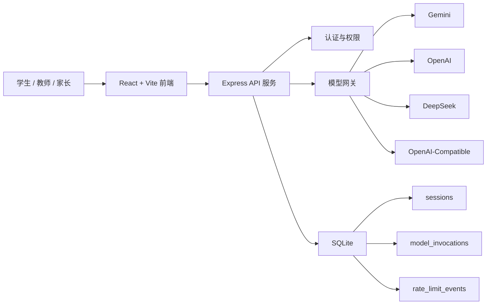
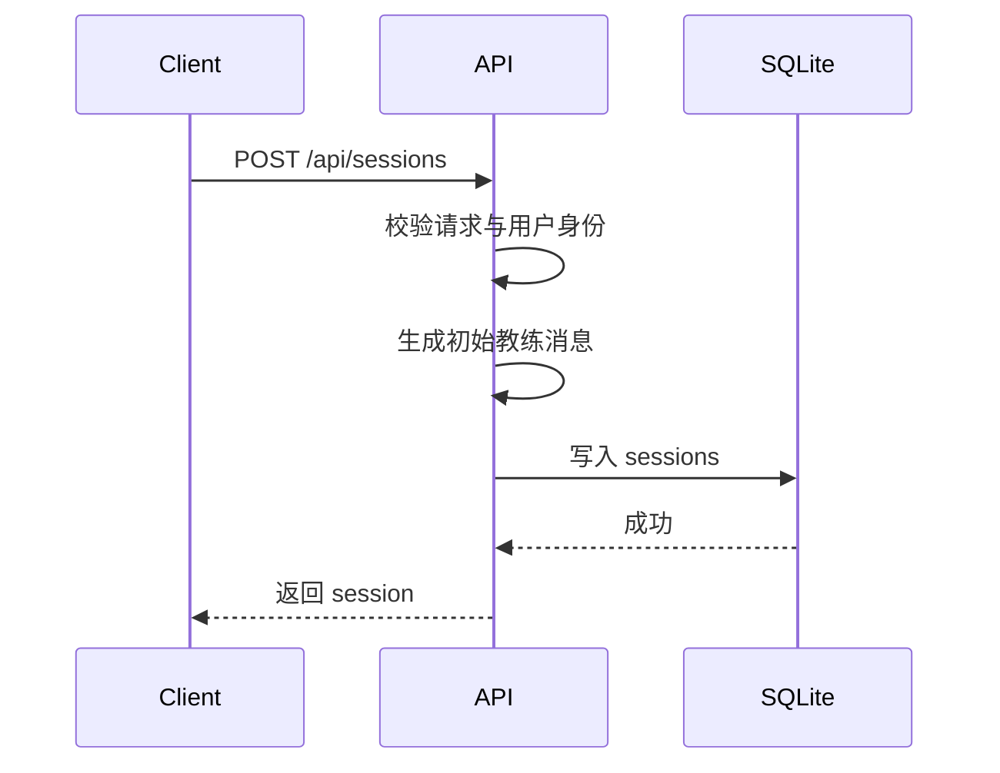
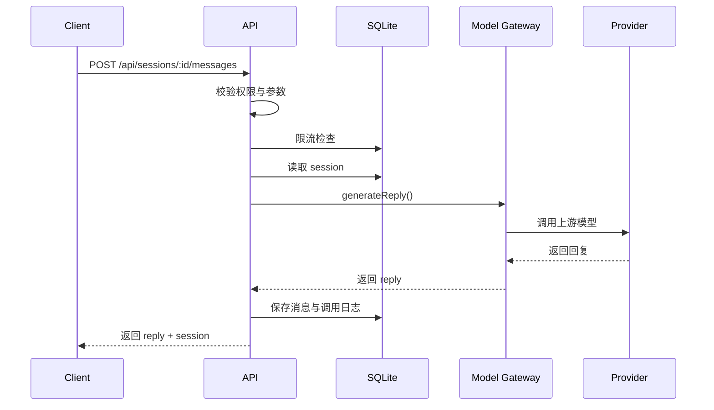
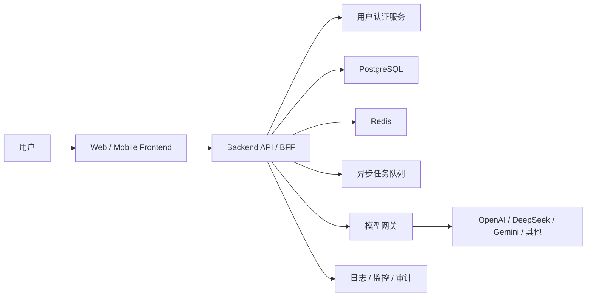

# 技术架构说明

## 1. 架构目标

当前架构目标不是“最复杂”，而是“尽快从前端原型升级为可试用的后端支撑产品”。因此本项目优先解决四件事：

- 模型密钥服务端托管
- 会话与草稿持久化
- 用户隔离与限流
- 多模型 provider 可切换

## 2. 当前架构总览

## 3. 当前模块划分

### 3.1 前端

- 技术：React 19 + Vite
- 责任：作文题目输入、五步流程 UI、聊天区、草稿区
- 当前状态：已接入后端 API，负责会话创建、恢复、草稿自动保存、阶段切换和消息发送

### 3.2 后端 API

- 技术：Express
- 责任：会话管理、草稿保存、阶段推进、模型代理、鉴权、限流、调用日志、报表
- 入口文件：`backend/server.js`

### 3.3 认证模块

- 文件：`backend/auth.js`
- 模式：
  - `disabled`
  - `api-key`
- 当前能力：
  - 解析 `Authorization: Bearer <key>` 或 `X-API-Key`
  - 普通用户仅能访问自己的数据
  - `admin` 可访问全量数据

### 3.4 模型网关

- 文件：`backend/model-gateway.js`
- 目标：统一不同模型服务商的调用方式
- 当前支持：
  - `gemini`
  - `openai`
  - `deepseek`
  - `openai-compatible`
- 当前能力：
  - provider 配置解析
  - 重试机制
  - 兼容 OpenAI Chat Completions 协议

### 3.5 数据访问层

- 文件：`backend/database.js`
- 技术：Node `node:sqlite`
- 责任：
  - 初始化表结构
  - 会话 CRUD
  - 软删除与恢复
  - 模型日志读写
  - 用量报表聚合
  - SQLite 限流
  - 导入历史 JSON 会话

### 3.6 用量估算模块

- 文件：`backend/usage-metrics.js`
- 责任：
  - 估算请求/响应 token
  - 根据 `MODEL_PRICING_JSON` 估算成本

## 4. 关键业务流程

### 4.1 创建写作会话

### 4.2 发送消息并调用模型

## 5. 数据存储架构

- 主存储：SQLite
- 文件路径：`data/teen-writing-coach.db`
- 历史兼容：启动时导入 `data/sessions/*.json`

当前设计适用于：

- 本地开发
- 单机部署
- 小规模真实试用

当前设计不适用于：

- 多实例共享写入
- 高并发生产环境
- 复杂分析查询场景

## 6. 安全设计

- 模型 API key 存放于服务端环境变量
- API 支持认证模式切换
- 会话、日志、报表都按用户权限隔离
- 消息接口启用 SQLite 级限流
- 预期型上游错误降级为单行 warn，降低日志噪音

## 7. 现状与技术债

### 7.1 已解决的问题

- 不再要求把模型密钥暴露到前端
- 不再依赖 JSON 文件做主存储
- 支持多 provider，而不是绑定单一模型厂商

### 7.2 仍存在的问题

- 当前认证是静态 API key，不适合正式 C 端用户体系
- SQLite 不适合未来多副本部署
- 缺少统一配置校验、结构化日志与告警体系

## 8. 目标架构

## 9. 架构演进建议

- 第一优先级：补端到端联调验证与少量前端体验收尾
- 第二优先级：鉴权从静态 API key 升级为正式用户体系
- 第三优先级：SQLite 升级到 PostgreSQL，限流升级到 Redis
- 第四优先级：补充后台报表、审计、监控与告警
